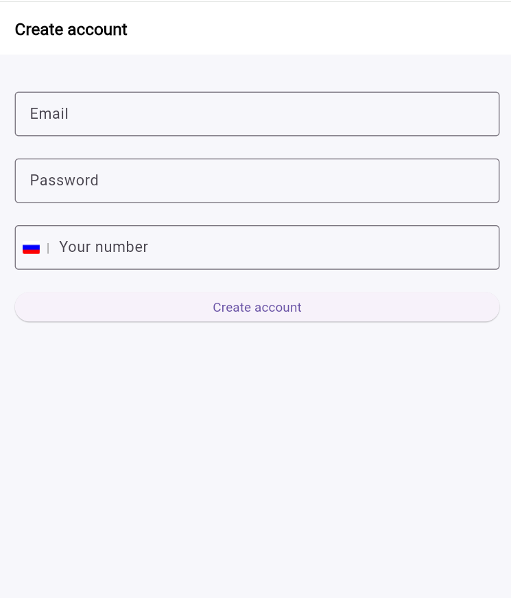
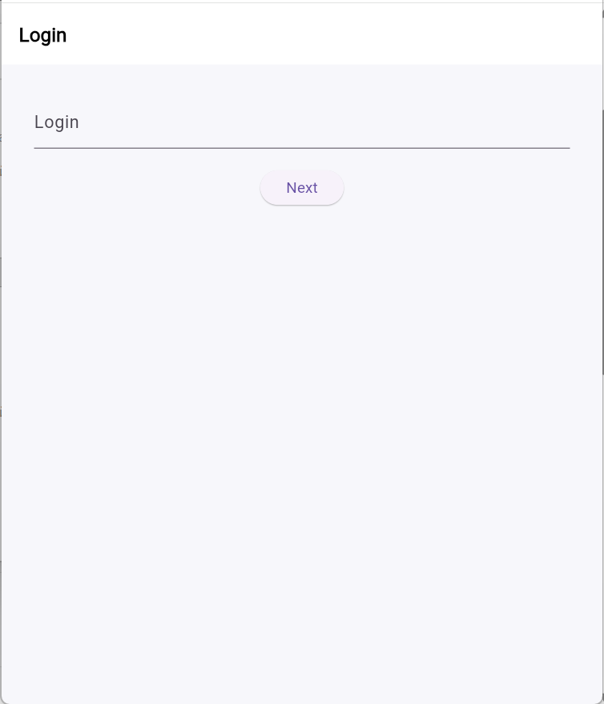
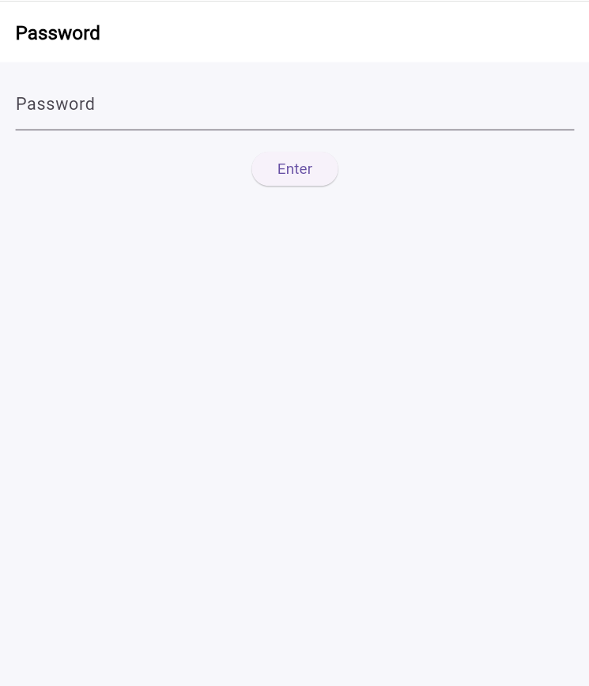
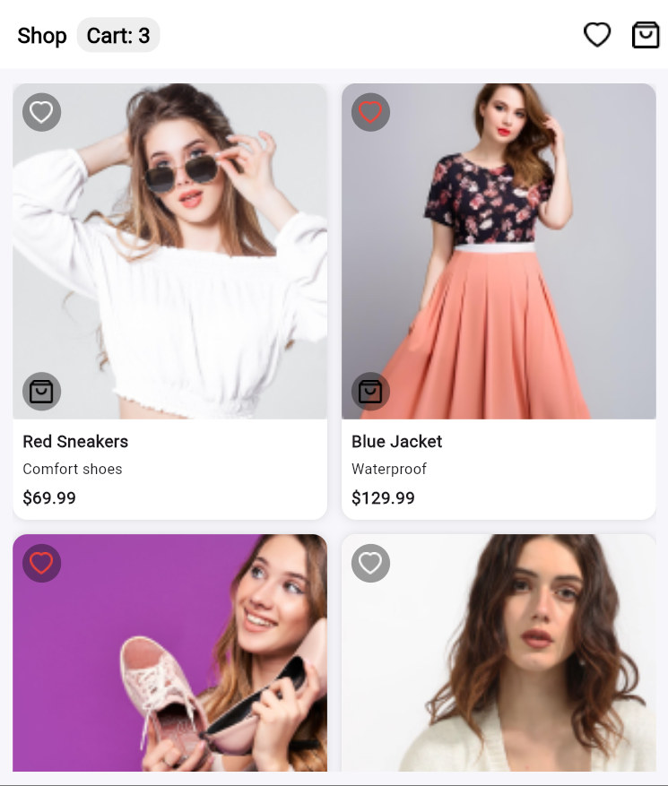
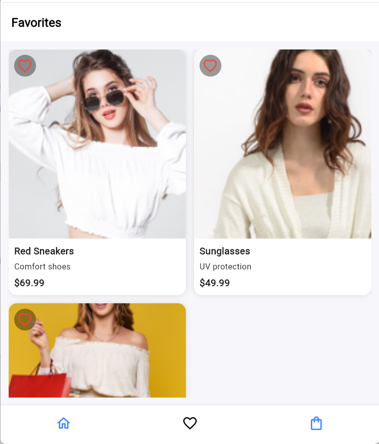
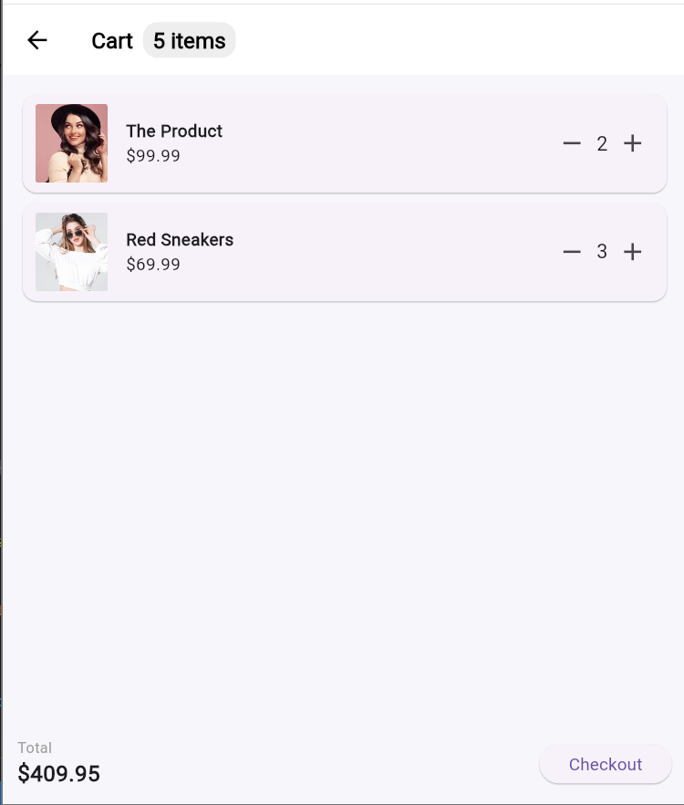

# Практическое задание № 6.
## Выполнил: Еремин Кирилл Денисович, ЭФБО-10-23

#### Был выполнен перенос готового дизайна из Figma во Flutter.
### Скриншоты ключевых экранов:
**1. Создание аккаунта**

**2. Ввод логина**

**3. Ввод пароля**

**4. Магазин**

**5. Избранное**

**6. Корзина**

### Краткий анализ:
* Была реализована базовая логика приложения с применением основных дизайнерских элементов (иконок)

* Необходимо доработать оформление приложения: добавить фон, переместить панель навигации в нижнюю часть экрана, продправить расположение объектов на экранах и т.д.